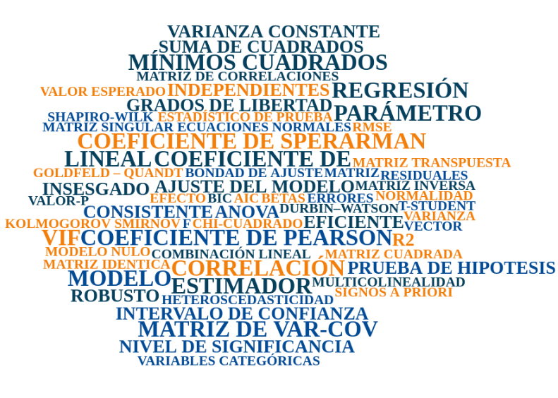

```{r setup, include=FALSE}
knitr::opts_chunk$set(echo = TRUE, comment = NA)
library(summarytools)
# install.packages("devtools") # solo una vez
# devtools::install_github("dgonxalex80/paqueteMODELOS", force = TRUE)

# colores
c1="#FF7F00"
c2="#=EB0C6"
c3="#034A94"
c4="#686868"

```

</br></br>

```{r, echo=FALSE, out.width="100%", fig.align = "center"}
knitr::include_graphics("img/banner_presentacion.png")
```

<!-- # <span style="color:#034a94">**Introducción**</span> -->

</br></br></br>

En esta unidad se presentan los principales conceptos del **Modelo de Regresión Lineal Múltiple** (RLM), su estructura en forma matricial, estimación por el método de Mínimos Cuadrados Ordinarios (MCO), las propiedades de los estimadores, los supuestos que lo rigen, la validación de los mismos, inferencia tanto para los estimadores como las predicciones y pronósticos de la variable dependiente, el problema de la multicolinealidad y el código en R relacionado con las anteriores estimaciones y validaciones.


Estarémos utilizando varios conceptos y métodos estadísticos que nos permita un manejo adecuado del análisis de regresión lineal


```{r, echo=FALSE, out.width="100%", fig.align = "center"}

```

</br></br>

El siguiente es el contenido de la unidad:

</br>

* **Conceptos**
  * Modelo de Regresión Lineal Múltiple
  * Correlación
  * Algebra Lineal
  * Notación matricial del modelo de regresión

</br>

* **Estimación**
  * Mínimos cuadrados ordinarios
  * Propiedades de los estimadores
  * Validación de los supuestos

</br>

* **Inferencia**
  * Inferencia sobre los parámetros
  * Inferencia sobre un subconjunto de parámetros
  * Pronósticos

</br>

* **Ajustes del modelo**
  * Indicadores de ajustes
  * Validación cruzada
    
</br>

* **Variables categçoricas**
  * En el modelo de Regresión Lineal Múltiple

</br>

* **Multicolinealidad**
  * Multicolinealidad
  * Causas/Efectos
  * Diagnóstico
  * Alternativas
  
</br>

* **Código R**
  * Análisis previo
  * Estimacion de Mínimos Cuadrados Ordinarios
  * Validación cruzada
  * Mapa

  

