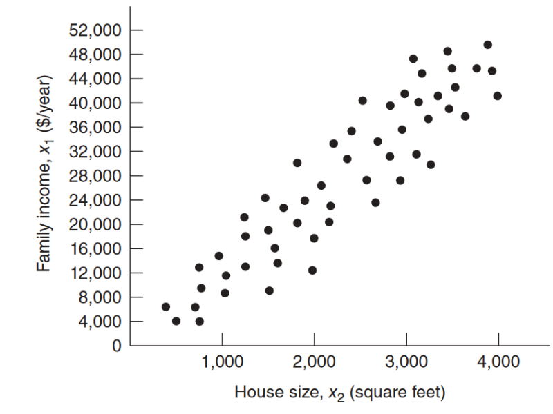

```{r setup, include=FALSE}
knitr::opts_chunk$set(echo = TRUE)
library(paqueteMODELOS)
data("creditos")

```

</br></br>


## <span style="color:#034a94">**Causas de la multicolinealidad**</span>

</br>

Algunas de las causas más comunes de la multicolinealidad son:

</br>

### <span style="color:#034a94">**Correlación entre variables predictoras:** 

Si dos o más variables predictoras están altamente correlacionadas, esto indica que proporcionan información similar o redundante al modelo. Por ejemplo, si estás modelando el precio de una casa y tienes tanto el área construida como el número de habitaciones como predictores, es probable que estas dos variables estén correlacionadas.

</br>

### <span style="color:#034a94">**Inclusión de variables derivadas:** 

Si incluyes variables derivadas o calculadas a partir de otras variables en el modelo, es posible que estas nuevas variables tengan una alta correlación con las variables originales, lo que puede llevar a multicolinealidad. Por ejemplo, si tienes la altura y el peso de una persona y luego incluyes el índice de masa corporal (IMC) calculado a partir de estas dos variables, es probable que haya multicolinealidad.

</br>

### <span style="color:#034a94">**Variables categóricas correlacionadas:** 

Si incluyes variables categóricas que están relacionadas entre sí, como regiones geográficas o categorías similares, podrían generar multicolinealidad si hay patrones de correlación entre estas variables categóricas.

</br>

### <span style="color:#034a94">**Sobreajuste del modelo:** 

Cuando se incluyen demasiadas variables predictoras en el modelo en comparación con el número de observaciones, aumenta la probabilidad de multicolinealidad. Si el número de observaciones es mucho menor que el número de variables predictoras, el modelo puede intentar ajustarse a los datos de manera excesiva, lo que podría llevar a la multicolinealidad.

</br>

### <span style="color:#034a94"> **Medición de variables similares:** 

Si tienes variables que miden conceptos muy similares o relacionados, como diferentes medidas de ingresos (salario, bonificaciones, ingresos totales), es posible que estas variables estén altamente correlacionadas y, por lo tanto, contribuyan a la multicolinealidad.

</br>

### <span style="color:#034a94">**Errores de medición:** 

Si las variables predictoras se miden con errores de medición considerables, esto puede generar una aparente correlación alta entre las variables incluso si en realidad no existe una relación causal.


<!-- Muestras recogidas en un rango reducido de valores. -->

<!-- ```{r, echo = F, fig.align = 'center', fig.height = 6, fig.width = 6, out.width = '50%'} -->
<!-- #data3.1 <- read_excel("data-ex-3-1.xls")[, -1] -->
<!-- #pairs(data3.1, lower.panel = myPanel.cor, diag.panel = myPanel.box, #upper.panel = panel.smooth, labels = names(data3.1)) -->
<!-- ``` -->

<!--  <!-- **Datos de tiempos de entrega** (*Fuente: Mongomery et al. (2002)*) --> 

<!-- </br> -->


<!-- ###  <span style="color:#034a94">**Restricciones en el modelo o en la población.**</span>  -->

<!-- <!-- <center> --> 
<!-- <!-- ```{r, echo=FALSE, out.width="60%", fig.align = "center"} --> 
<!-- <!--  --> 
<!-- <!-- ``` --> 
<!-- <!-- Fuente: Datos de consumo de electricidad - Mongomery et al. (2002) -->
<!-- <!-- </center> --> 

<!-- </br> -->


<!-- ### <span style="color:#034a94">**Especificación del modelo.**</span>  -->

<!-- Por ejemplo, al agregar términos polinomiales a un modelo cuando el rango de la predictora es pequeño. -->

<!-- </br> -->

<!-- ### <span style="color:#034a94">**Un modelo sobredefinido.**</span>  -->

<!-- Por ejemplo, en investigación médica donde para algunos pocos pacientes se toma una gran cantidad de predictoras. Es decir que posee más variables que observaciones. -->


</br></br></br>

## <span style="color:#034a94">**Efectos de la multicolinealidad**</span>

</br></br>

Algunos de los efectos más notorios de la multicolinealidad son:

</br>

### <span style="color:#034a94">**Inflación de las varianzas de los estimadores:**</span> 

Consiste en la inflación de los valores $c^*_{jj}$ en las varianzas de los estimadores $V(\widehat\beta_j^*) = \sigma^2 c^*_{jj}$, cuando se considera un modelo con variables escaladas de longitud unitaria, en cuyo caso se puede demostrar que:

$$
c^*_{jj} = \frac{1}{1 - R_j^2},
$$

</br>

donde $R_j^2$ es el coeficiente de determinación muestral obtenido de una regresión de $X_j$ (como respuesta) en función de las otras variables predictoras consideradas en el modelo (actuando como predictoras de la primera).

</br></br>

### <span style="color:#034a94">**$\boldsymbol{\widehat{\beta}_j}$ muy grandes en términos absolutos:**</span> 

Esto se manifiesta en una traza muy grande de la matriz $\left(\boldsymbol{X}'\boldsymbol{X}\right)^{-1}$, donde: 

$$\text{traza}\left(\boldsymbol{X}'\boldsymbol{X}\right)^{-1} = \sum_{j = 1}^{p} \frac{1}{\lambda_j}$$  

y  $\lambda_j > 0$ es el $j$-ésimo valor propio (usualmente ordenados de mayor a menor) de la matriz $\boldsymbol{X}'\boldsymbol{X}$.

</br>

Si la $\text{traza}\left(\boldsymbol{X}'\boldsymbol{X}\right)^{-1}$ es muy grande, mayor es la distancia entre el vector de parámetros estimados y el verdadero valor del vector de parámetros.

</br></br>

### <span style="color:#034a94">**Valores de los coeficientes con signo contrario a lo esperado:**</span> 

Esto puede ser causado por la presencia de multicolinealidad.


</br></br>

### <span style="color:#034a94">**Regresión significativa pero ninguna variable individualmente significativa:**</span> 

Otra de las maneras en que se puede manifestar la multicolinealidad grave es cuando el modelo de regresión ajustado es significativo (según la prueba $F$ de la tabla ANOVA) pero individualmente, ninguno de los coeficientes asociados a las variables predictoras resulta significativo (según las pruebas $T$ de significancia individual).


</br></br>
