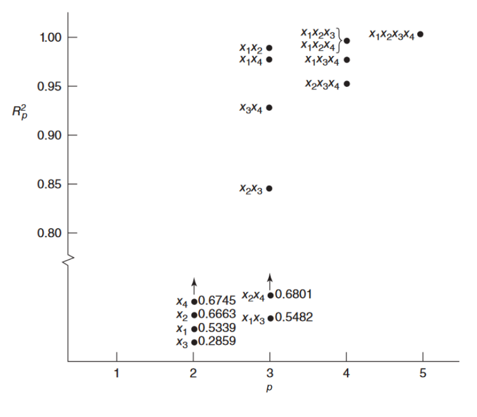
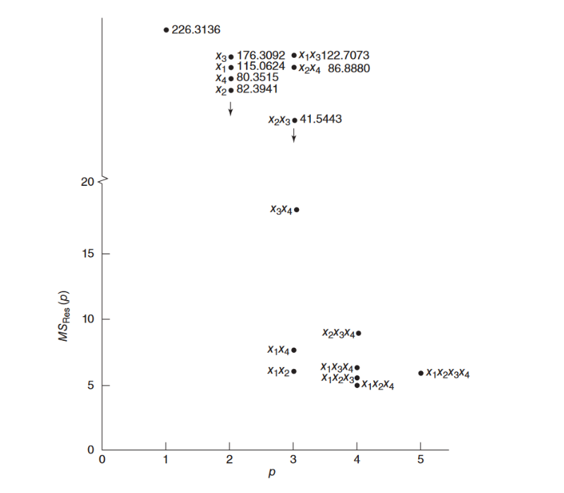
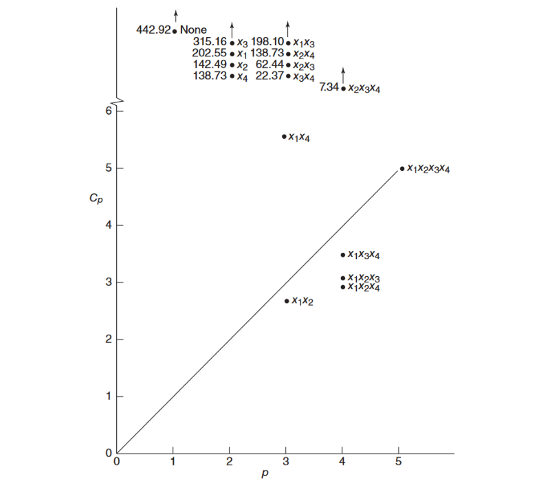

```{r setup, include=FALSE}
knitr::opts_chunk$set(echo = TRUE)
library(paqueteMODELOS)
data("creditos")

```

</br></br>

</br></br>

## <span style="color:#034a94">**Selección de variables**</span>

</br>

En algunos estudios observacionales o exploratorios se parte de un modelo de regresión en el que se considera un conjunto grande de variables predictoras potenciales para luego identificar un subconjunto entre tales variables, que resulte potencialmente útil para construir el modelo de regresión final.

</br>
Dependiendo de los usos que se deseen dar a un modelo de regresión variará el subconjunto de variables seleccionadas. Por ejemplo, desde el punto de vista del ajuste, cierto subgrupo de variables serán útiles, en tanto que desde el punto de vista del pronóstico, otro subconjunto podría resultar ser mejor. Es necesario pues fijar un criterio de selección del mejor subconjunto de variables.

</br></br>

## <span style="color:#034a94">**Método de todas las regresiones posibles**</span>

</br>

Este procedimiento consiste en correr todos los $2^k - 1$ modelos posibles (con intercepto) de la variable respuesta vs. los posibles subconjuntos de variables predictoras,

</br>

$$
\begin{aligned}
	&\left(\begin{array}{c} k\\1\end{array}\right) = k &&\text{modelos de una predictora}\\
	&\left(\begin{array}{c} k\\2\end{array}\right) &&\text{modelos de dos predictoras}\\[-0.2cm]
	&\,\quad\ \vdots\\[-0.2cm]
	&\left(\begin{array}{c} k\\k\end{array}\right) = 1 &&\text{modelo de }k\text{ predictoras}\\[-0.2cm]
	&\rule{1in}{1pt}\\[-0.1cm]
	&\;\ \quad2^k - 1 &&\text{modelos posibles,}
\end{aligned}
$$

</br>

y comparar tales modelos con base en criterios estadísticos.

</br></br></br>

## <span style="color:#034a94">**Criterios estadísticos en la comparación de modelos**</span>


</br>

###  $\boldsymbol{R^2_p}$

El mejor modelo es aquel con el mayor valor en este estadístico, sin embargo, al ser una función no decreciente del número de predictoras, tiende a señalar al modelo con todas las predictoras.

Con el fin de resolver esta dificultad, se busca un modelo con un menor número de variables cuyo $R^2$ no cambie significativamente al aumentar el número de predictoras.

</br></br>

### **Ilustración criterio $\boldsymbol{R^2_p}$**

</br>
<center>
```{r, echo=FALSE, out.width="70%", fig.align = "center"}

```

Fuente: Mongomery et al. (2002)
</center>

</br></br>

* $\boldsymbol{R_{\textbf{adj,p}}^2}$ (o $\textbf{MSE}_{\boldsymbol{p}}$): el mejor modelo es aquel con mayor (menor) valor en este estadístico.

</br></br>

<center>
```{r, echo=FALSE, out.width="70%", fig.align = "center"}

```

Fuente: Mongomery et al. (2002)
</center>

</br></br>


### **$\boldsymbol{C_p}$ de Mallows**

El mejor modelo es aquél para el cual $C_p$ es el más pequeño posible (es decir, el modelo con el menor número de variables predictoras posible) y tal que la diferencia $\vert C_p - p\vert$ es mínima, con $p$ igual al número de parámetros del modelo considerado, incluyendo el intercepto.


Este estadístico es una medida del sesgo en el modelo de regresión, es decir, de $E\left(\widehat{Y}_i\right) - \mu_i$, y es tal que a mayor sesgo, mayor $C_{p}$. Este estadístico se calcula como:
</br>


$$
C_p = \frac{\text{SSE}_p}{\text{MSE}\left(\beta_0, \beta_1, \ldots, \beta_k\right)} - \left(n - 2p\right)
$$ 

</br>

donde $\text{SSE}_p$ es la suma de cuadrados del error del modelo considerado y $\text{MSE}\left(\beta_0, \beta_1, \ldots, \beta_k\right)$ es el cuadrado medio del error para el modelo de regresión con todas las $k$ variables.

</br></br>

**Ilustración criterio $\boldsymbol{C_p}$**

</br>

<center>

```{r, echo=FALSE, out.width="70%", fig.align = "center"}

```

Fuente: Mongomery et al. (2002)
</center>

</br></br>

### **$\textbf{PRESS}_{\boldsymbol{p}}$**

Tambienllamado  suma de cuadrados de predicción, mide qué también el uso de los valores ajustados por un submodelo puede predecir las respuestas observadas. Mientras menor sea esta medida, mejor se considera el modelo. 

</br>

El PRESS es como un SSE, pero en el cual el valor ajustado para cada observación $Y_i$ se halla estimando el submodelo sin considerar dicha observación, tales valores ajustados se denotan por $\widehat{Y}_{\left(i\right)}$; así el PRESS es la suma de cuadrados de los residuales de predicción $e_{\left(i\right)} = Y_i - \widehat{Y}_{\left(i\right)}$, es decir, $\text{PRESS}_p = \sum\limits_{i = 1}^n e_{\left(i\right)}^2$.

</br>

Para cada submodelo, la definición del error de predicción implica correr $n$ regresiones separadas (cada una con $n - 1$ datos) con cada observación eliminada en cada caso, sin embargo, basta con correr una vez el modelo con todas las observaciones, hallar sus residuales ordinarios, y los elementos de la diagonal principal de la matriz hat y calcular $e_{\left(i\right)} = e_i /\left(1 - h_{ii}\right)$.

</br>

Si se usan dos o más criterios de selección de modelos, es posible que cada criterio lleve a modelos distintos. La decisión final debe basarse en el análisis de residuales y otros diagnósticos, además de complementar con el conocimiento y la experiencia de personas expertas en el ámbito en el cual está inmerso el problema.


</br></br>

## <span style="color:#034a94"> **Método paso a paso o Stepwise**</span>

</br></br>

Este método selecciona las variables paso a paso. En cada paso puede incorporar una variable o eliminarla segun criterio de inclusión o exclusión.

</br>

**Paso 1**: Incluye la variable más correlacionada con la variable dependiente, validando el criterio de inclusión. 

</br>

**Paso 2**:  Se incluye en el modelo una segunda variable con el mayor coeficiente de correlación parcial con la variable dependiente, excluida la variable introducida en el primer paso, validando el criterio de inclusión. 

</br>

**Paso 3**:  Se incluye la variable con mayor coeficiente de correlación parcial con la variable dependiente, excluidas las dos variables que estan en el modelo, validando el criterio de inclusión. 

</br>

**Paso 4** : Cuando al verificar el criterio de inclusión y 

</br>

Existen dos versiones del método, una hacia atrás, el cual parte incluye todas las variables independientes sin importar que tan realacionadas se encuentren entre si. En cada paso elimina una variable y finaliza cuando el valor del  estadístico F de la ANOVA correspondiente aumente en una cantidad tolerable, previamente establecida.

</br>

En el caso del método paso a paso adelante, inicia con una sola variable independiente, escogiendo la que mayor correlación tenga con la variable dependiente y va incorporando variables hasta tanto el valor del incremento del valor del estadístico F, sea no significativo comparado con un valor establecido previamente.

</br></br>
