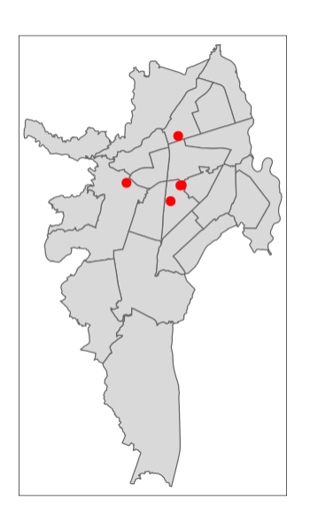

```{r setup, include=FALSE}
knitr::opts_chunk$set(echo = TRUE, comment = NA)

library(paqueteMODELOS)
data("arboles1")
arboles1$D1 = as.numeric(arboles1$mg=="GENOTIPO_2")
arboles1$D2 = as.numeric(arboles1$finca=="FINCA_2")
arboles1$D3 = as.numeric(arboles1$finca=="FINCA_3")
arboles1$peso = as.numeric(arboles1$peso)
arboles1$diametro = as.numeric(arboles1$diametro)
arboles1$altura = as.numeric(arboles1$altura)


# library(tidyverse)
# library(lmtest) # diagnosticos de modelos lineales
# library(sandwich) # errores estandar robustos
# library(ggeffects) # efectos y predicciones en modelos de regresion
# library(modelsummary) # tablas de regresion

```


</br></br>

El siguiente código permite la visualización de puntos en el mapa de la ciudad de Cali, teniendo como base el archivo cali.shp que debe estar acompañado de otros archivos contenidos en la carpeta comprimidad cali.zip


###  <span style="color:#034A94">**Paso1 : Cargar archivo cali.shp**</span>

```{r,  eval=FALSE}
library(raster)
library(sf)
library(tmap)

cali=shapefile("map/cali/cali.shp")
```


</br></br>

###  <span style="color:#034A94">**Paso 2 : Construir mapa de Cali**</span>

```{r , eval=FALSE}
cali.tmap = tm_shape(cali) +  tm_polygons()
# cali.tmap  # mapa
```


</br></br>

###  <span style="color:#034A94">**Paso 3 : Crear conjunto de puntos a marcar en mapa . Coordenadas de latitud y de longitud en data.frame**</span>


```{r, eva=FALSE}
oferta=data.frame(lat=c(3.43382,     3.43369,   3.42566,      3.435,   3.45891),
                  long=c(-76.51168, -76.51237, -76.51737,    -76.54,  -76.5135))

# convierte el data.frame en objeto sfc 
# oferta_sf=st_as_sf(oferta, coords = c('long', 'lat'))
#            , crs = st_crs(cali)$proj4string)
```


</br></br>

###  <span style="color:#034A94">**Paso 4: Construir mapa y marcar puntos**</span>

```{r, eval=FALSE}
cali2 = tm_shape(cali) +  tm_polygons() + 
        tm_shape(oferta_sf) + tm_dots(size=0.3, col="red")
cali2 


```


</br>

```{r, echo=FALSE, out.width="40%", fig.align = "center"}

```

</br></br>

<div class="content-box-gray">
### <span style="color:#686868"> **Nota**</span>

* Debe instalar lo paquetes : 
  + `raster`
  + `sf`
  + `tmap`
  
* Copie la carpeta Cali con el contenido de los archivos en el directorio donde está el archivo Rmd fuente (ubicada en Actividades : `map.zip`)

* Debe actualizar la dirección del archivo `cali.shp`

* La ubicación de un archivo en R se puede obtener utilizando la función  `file.choose()` desde la consola. 

</div>

</br></br>

<div class="content-box-gray">
### <span style="color:#686868"> **Resumen**</span>


```{r, eval=FALSE}
library(raster)
library(sf)
library(tmap)


cali=shapefile("~/map/cali/cali.shp")
cali.tmap = tm_shape(cali) +  tm_polygons()
cali.tmap  # mapa

qtm(cali) # mapa 2

 oferta=data.frame(lat=c(3.43382,     3.43369,   3.42566,      3.435,   3.45891),
                  long=c(-76.51168, -76.51237, -76.51737,    -76.54,  -76.5135))
 
oferta_sf=st_as_sf(oferta, coords = c('long', 'lat'))
#            , crs = st_crs(cali)$proj4string)


cali2 = tm_shape(cali) +  tm_polygons() + 
        tm_shape(oferta_sf) + tm_dots(size=0.3, col="red")
cali2 
```

<div>


</br></br>

```{r, echo=FALSE, out.width="40%", fig.align = "center"}

```
